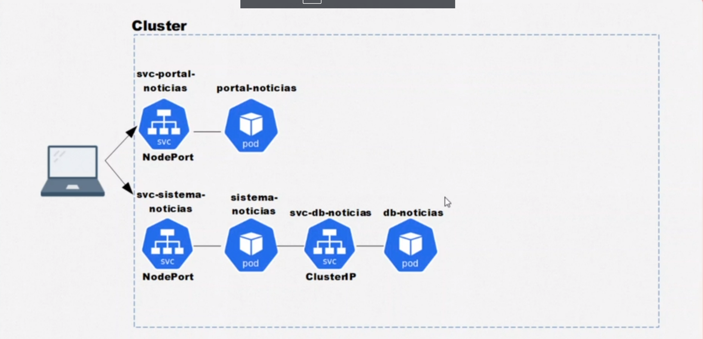

# Kubernetes Project Example
This is an example Kubernetes project made available in the Alura course "Kubernetes: Deploy your microservices with confidence".

## Requirements
To run this project, you will need the following installed in your machine:

- Docker Desktop
- Kubernetes (minikube or kubeadm)

## Project structure

## Technologies you should know from Kubernetes

- Pod: A pod is the smallest and simplest unit in the Kubernetes object model. It represents a single instance of a running process in a cluster. A pod can contain one or more containers, which share the same network namespace and can communicate with each other using localhost. Pods are generally created and managed by a controller object like a Deployment or StatefulSet.

- Service (svc): A service is an abstraction layer that exposes a set of pods as a network service. It provides a stable IP address and DNS name for a set of pods, and load balances traffic among them. Services can be used to decouple the frontend and backend of an application, and allow them to scale independently. There are several types of services in Kubernetes, including ClusterIP, NodePort, and LoadBalancer.
Services can be segmented in different ways, including:
ClusterIP: This type of service exposes the service on a cluster-internal IP address. This is the default service type, and it makes the service only reachable from within the cluster. This is useful for applications that need to communicate internally, but don't need to be exposed to the outside world.
NodePort: This type of service exposes the service on a static port on each node's IP address. This means that the service can be accessed from outside the cluster, but it is not recommended to use in production environments.
LoadBalancer: This type of service creates an external load balancer in the cloud provider's network that routes traffic to the service. This makes the service accessible from outside the cluster, and it is commonly used in production environments.
ExternalName: This type of service maps a service to an external address. This is useful for services that need to communicate with external systems or services, such as a database or messaging service.

- ConfigMap (cm): A ConfigMap is an object in Kubernetes that allows you to store configuration data in key-value pairs. It can be used to store environment variables, command-line arguments, and configuration files for an application. ConfigMaps can be used to separate configuration data from application code, making it easier to manage and update configuration data without changing the application itself.

