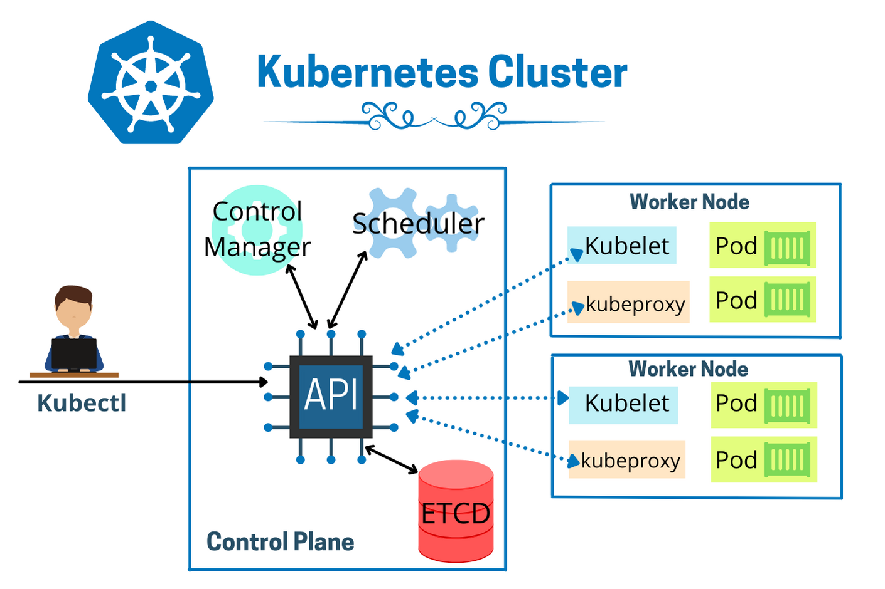
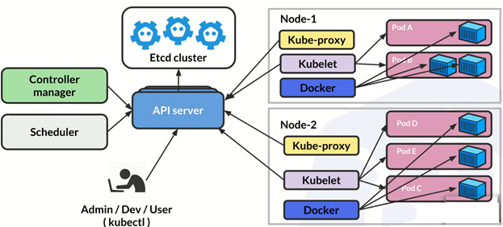

# what happens behind kubernetes

Kubernetes is an open-source container orchestration platform that automates many of the manual processes involved in deploying, managing, and scaling containerized applications. It provides a platform-agnostic way to deploy, scale, and manage containerized applications, making it easier to run and scale applications in production. Kubernetes works by providing a unified API for managing containerized applications, automating the deployment and scaling of these applications, and managing their lifecycle. With Kubernetes, developers can focus on building applications without having to worry about the underlying infrastructure, while operations teams can manage and scale applications with ease.

Kubernetes can be thought of as a cluster management tool. It allows you to manage and orchestrate a cluster of containerized applications, where each application is deployed in one or more containers. The cluster can consist of multiple nodes (physical or virtual machines) that work together to run and manage these containers. Kubernetes provides a way to automate the deployment, scaling, and management of containerized applications across the cluster, providing fault tolerance, self-healing, and easy scaling.

 

font this image: https://hacksheets.in/kubernetes-cluster-interactive-architecture-diagram/

## What problem does Kubernetes solve?

Kubernetes was developed to solve the problem of managing containerized applications at scale. As more and more applications were containerized and deployed in production environments, it became increasingly difficult to manage them manually. Kubernetes provides a way to automate the deployment, scaling, and management of containerized applications, making it easier to manage large clusters of containers.

Some specific problems that Kubernetes can solve include:

<li>
Orchestrating container deployments: Kubernetes can automate the deployment of containers across a cluster of nodes, making it easier to manage and scale containerized applications.</li>
<li>Scaling applications: Kubernetes can automatically scale applications up or down based on demand, ensuring that applications have enough resources to handle traffic.</li>
<li>Managing container health: Kubernetes can monitor containers and automatically restart or replace them if they fail.</li>

<li>Load balancing: Kubernetes can automatically distribute network traffic across multiple containers, ensuring that applications are highly available and scalable.</li>
<li>Rolling updates and rollbacks: Kubernetes can perform rolling updates and rollbacks of applications, allowing for seamless updates without downtime.</li>

 

## Where Can I use the Kubernetes?
Kubernetes can be used in various environments, including local machines, cloud providers (such as Amazon Web Services, Google Cloud Platform, and Microsoft Azure), and on-premise data centers. It provides a consistent way to deploy, manage, and scale applications across different environments. It is important to note that the setup and configuration of Kubernetes can vary depending on the deployment environment. For example, when using a cloud provider, the process of setting up a Kubernetes cluster may be different compared to running it on a local machine.

## Control Plane
In Kubernetes, the control plane refers to the set of components that are responsible for managing the state of the cluster. It includes several key components such as the API server, etcd, scheduler, and controller manager.

The API server acts as the front-end for the Kubernetes control plane, providing a way for users and applications to interact with the cluster. etcd is a distributed key-value store that is used to store all of the cluster's configuration data. The scheduler is responsible for scheduling pods onto nodes in the cluster, while the controller manager monitors the state of the cluster and ensures that it remains in the desired state.

Together, these components make up the control plane, which is responsible for maintaining the overall health and functionality of the Kubernetes cluster.

<li>API Server: The Kubernetes API server is the entry point for all Kubernetes cluster operations. It is the front-end for the Kubernetes control plane and provides a RESTful interface for cluster management. It is responsible for processing and validating API requests, enforcing authorization policies, and updating the state of the API objects.</li>
<li>etcd: etcd is a distributed key-value store that stores the configuration data of the Kubernetes cluster. The etcd cluster provides a reliable, consistent, and highly available data store for the entire Kubernetes cluster. All the state information of the Kubernetes cluster, such as cluster configuration, pod states, service information, and other metadata, is stored in etcd.</li>

<li>Scheduler: The Kubernetes scheduler is responsible for scheduling pods to run on the worker nodes. The scheduler takes into account various factors such as resource requirements, node affinity, and anti-affinity policies, and selects the best node to run the pod. The scheduler works in conjunction with the API server to determine which nodes are available to run the pod and selects the best node based on the scheduling algorithm.</li>

<li>Controller Manager: The Kubernetes controller manager is responsible for managing and controlling the state of the Kubernetes cluster. It consists of various controllers that perform tasks such as node management, replication control, endpoint management, and service account management. The controller manager constantly monitors the state of the Kubernetes cluster and makes sure that the desired state is achieved.</li>

## Worker Node
Each worker node in a Kubernetes cluster can be a physical or virtual machine. Kubernetes is designed to be a flexible and portable platform that can be run on a variety of infrastructures, including on-premises data centers, public clouds, and hybrid cloud environments. The worker nodes in a Kubernetes cluster are responsible for running and managing the containers that make up the applications. These nodes can be scaled up or down based on the needs of the applications, and Kubernetes provides a number of tools to manage the cluster and its resources efficiently.
A worker node is a node in a Kubernetes cluster that is responsible for running the containers. Each worker node runs a container runtime, such as Docker or CRI-O, and a kubelet, which is an agent that communicates with the control plane to manage the node's containers.

The kubelet is responsible for the following tasks on a worker node:

Communicating with the API server to receive container manifest and pod assignments.
Pulling container images from a container registry, such as Docker Hub.
Running the containers specified in the pod manifests.
Monitoring the containers' health and reporting any issues to the control plane.
Cleaning up any containers or pods that are no longer needed.
Kube-proxy is another component of the worker node that is responsible for implementing Kubernetes services. A service is a set of pods that are logically grouped together and exposed to the network through a single IP address. Kube-proxy ensures that incoming network traffic to the service is directed to the appropriate pod in the service.

A pod is the smallest and simplest unit in the Kubernetes object model. It represents a single instance of a running process in a cluster. A pod can contain one or more containers, which are tightly coupled and share the same network namespace, storage volumes, and other resources. Pods are ephemeral, meaning that they can be created, deleted, or replaced at any time by the Kubernetes control plane.

Imagine a large company with multiple departments, each with its own team of workers. The company's headquarters can be seen as the control plane, where the top-level management oversees the entire company's operations. The departments are the worker nodes, each with its own team of employees, equipment, and resources.

The department manager is like the kubelet, responsible for managing the workers and resources within their department. They receive instructions from the management team and ensure that their department is following the plan accordingly. The kubelet receives instructions from the control plane and ensures that the worker node is running as expected.

Now imagine each employee within the department is like a pod in Kubernetes. The pod is the smallest unit of deployment in Kubernetes, containing one or more containers that run a specific application. Each employee has their own specific skills and responsibilities, and they work together to complete a task or project. Similarly, each pod may contain different containers that work together to provide the desired functionality.

Finally, the kubeproxy is like the company's IT department, responsible for managing network traffic between departments. They ensure that all communication between departments is secure and efficient. In Kubernetes, the kubeproxy is responsible for managing network traffic between pods and ensuring that each pod can communicate with others.

# Second picture about the architecture of Kubernetes: 

Docker can talk to your application in a few different ways, depending on how you have set up your application and your Docker containers.

One common approach is to use Docker's networking features to connect your application container to a network, and then use that network to communicate with the application. For example, you might create a Docker network and start your application container and your database container on that network. You can then configure your application to use the database's IP address or hostname to connect to it, just as you would in a non-Dockerized environment.

Another approach is to use Docker's volume features to share files between your application container and your host machine or other containers. For example, you might mount a directory on your host machine into your application container using a Docker volume, and then write files to that directory from your application. Those files would be visible on your host machine, allowing you to interact with them directly.

Finally, you can also use Docker's port mapping features to expose specific ports on your application container to the host machine or to other containers. For example, you might start your application container with port 8080 exposed, and then use your web browser to connect to http://localhost:8080 to access your application.

Overall, Docker provides a range of features for connecting your application with other containers, with the host machine, and with external systems. The specifics of how you set up these connections will depend on the needs of your application and your infrastructure.

## Comunication between containers

Containers within the same pod can communicate with each other using localhost since they share the same network namespace. So, if there are multiple containers within a pod, they can communicate with each other directly via the loopback interface, without the need for network communication.

When communicating between pods, Kubernetes uses the concept of services. Services provide a stable IP address and DNS name that can be used by other pods to communicate with the pods running the application containers. Kubernetes creates a virtual IP address for each service, and any pod within the cluster can access this IP address to communicate with the pods associated with the service. This allows pods to communicate with each other across the network without having to know the specific IP addresses of the pods they want to communicate with.

So, to summarize, containers within the same pod can communicate with each other using localhost, while communication between pods is achieved through the use of services, which provide a stable IP address and DNS name for pods to communicate with each other.

